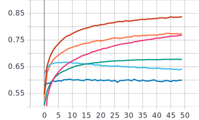
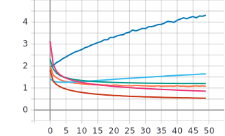
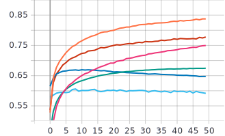
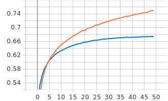
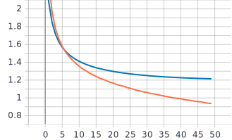

Лабораторная работа №3
====
# Цель лабораторной работы
Исследовать влияние параметра “темп обучения” на процесс обучения нейронной сети на примере решения задачи классификации Food-101 с использованием техники обучения Transfer Learning

# 1. С использованием техники обучения Transfer Learning обучить нейронную сеть EfficientNet-B0 (предварительно обученную на базе изображений imagenet) для решения задачи классификации изображений Food-101 с использованием фиксированных темпов обучения 0.01, 0.001, 0.0001 
 
* Изменение темпов обучения от 0.1 до 0.0001
```
#optimizer=tf.optimizers.Adam(lr=0.01)
#optimizer=tf.optimizers.Adam(lr=0.001)
#optimizer=tf.optimizers.Adam(lr=0.0001)
```

 ### Графики обучения для сети EfficientNet-B0 с фиксированными темпами обучения 0.01, 0.001, 0.0001:
 
* Оранжевый - темп 0.01 на тренировочной выборке 
   / Синий - темп 0.01 на валидационной выборке
   
* Красный - темп 0.001 на тренировочной выборке 
   / Голубой - темп 0.001 на валидационной выборке
   
* Розовый - темп 0.0001 на тренировочной выборке 
   / Зеленый - темп 0.0001 на валидационной выборке
  
**График метрики точности:** 


**График функции потерь:**



### Вывод:
Согласно полученным графикам наибольшая точность на обучающей выборке у графика с темпом равным 0.001, порядка 84%. Однако наибольшая точность на валидационных данных достигается зеленым графиком, который соответствует темпу 0.0001 с максимальной точностью около 67%. На графиках функции потерь, зеленый график так же показывает лучший результат. Он же является единственным невозрастающим, поэтому можно говорить об отстутствии переобучения. Исходя из этого, я считаю, что темп равный 0.0001 является оптимальным.


# 2. Реализовать и применить в обучении следующие политики изменения темпаобучения, а также определить оптимальные параметры для каждой политики: 
* Косинусное затухание (Cosine Decay)
* Косинусное затухание с перезапусками (Cosine Decay with Restarts)

**Теория эксперимента** 

# Косинусное затухание
 
```
tf.keras.experimental.CosineDecay(
    initial_learning_rate, decay_steps, alpha=0.0, name=None
)
```
* initial_learning_rate эксперементально подбирался (0.01, 0.001, 0.0001)
* decay_steps был взят как в [примере](https://www.tensorflow.org/api_docs/python/tf/keras/experimental/CosineDecay) равным 1000
* alpha - ограничение шагов, взят равным 0


## Графики обучения сети EfficientNet-B0 с различными темпами обучения
    
* Красный - темп 0.01 на тренировочной выборке 
   / Голубой - темп 0.01 на валидационной выборке
   
* Оранжевый - темп 0.001 на тренировочной выборке 
   / Синий - темп 0.001 на валидационной выборке
   
* Розовый - темп 0.0001 на тренировочной выборке 
   / Зеленый - темп 0.0001 на валидационной выборке

**График метрики точности:**


**График функции потерь:** 


### Вывод:
Лучшее значение точности достигается оранжевым графиком с темпом 0.001 с точностью около 84%. Однако в случае валидационных данных, лучший результат у темпа 0.0001 (зеленый график), точность около 67%. В данном случае здесь как и в предыдущем эксперименте лучшее на мой взгялд результат показал темп 0.0001.

# Косинусное затухание с перезапусками

```
tf.keras.experimental.CosineDecayRestarts(
    initial_learning_rate, first_decay_steps, t_mul=2.0, m_mul=1.0, alpha=0.0,
    name=None
)
```
* initial_learning_rate исходя из предыдущих опытов был взят равным 0.0001
* decay_steps был взят как в [примере](https://www.tensorflow.org/api_docs/python/tf/keras/experimental/CosineDecayRestarts) равным 1000
* alpha - ограничение шагов, взят равным 0
* t_mul - количество итераций на i-том периоде
* m_mul - начальное обучабщее ограничение на i-том периоде

## Графики обучения сети EfficientNet-B0
 
* Оранжевый - на тренировочной выборке 
   / Синий - на валидационной выборке
 
**График метрики точности:** 


**График функции потерь::** 


### Вывод:
Максимальная точность на тренировочной выборке достигается на 50 эпохе и имеет значение в 75%, аналогично с точностью на валидационных данных, но там значение точности равно 67%. Из графика потерь можно подметить, что за 50 эпох переобучение не возникает.


### Итоговое сравнение оптимальных результатов
Наилучшее значение точности на валидационных данных равно 67% и достигается всеми тремя способами при экспериментально подобранном значении темпа равное 0.0001. Если судить по тренировочной выборке, лучшее значение 84% в случаях фиксированного темпа обучения и косинусного затухания при значении темпа = 0.001. Таким образом, в ходе эксперимента значение 0.0001 показало лучшие значение точности на валидационных данных, как и меньшие значеня потерь соответственно. Так же при этом значении переобучение нейронной сети или минимизировалось или вовсе отсутствовало. Если говорить о наилучшем методе, то в нашем случае все показали практически (с учётом неточностей) одинаковый результат.

