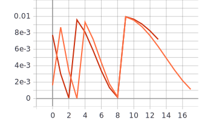
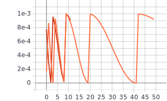
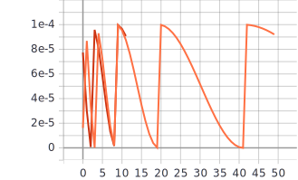

Лабораторная работа №3
====
# Цель лабораторной работы
Исследовать влияние параметра “темп обучения” на процесс обучения нейронной сети на примере решения задачи классификации Food-101 с использованием техники обучения Transfer Learning

# 1. С использованием техники обучения Transfer Learning обучить нейронную сеть EfficientNet-B0 (предварительно обученную на базе изображений imagenet) для решения задачи классификации изображений Food-101 с использованием фиксированных темпов обучения 0.01, 0.001, 0.0001 
 
* Изменение темпов обучения от 0.1 до 0.0001
```
#optimizer=tf.optimizers.Adam(lr=0.01)
#optimizer=tf.optimizers.Adam(lr=0.001)
#optimizer=tf.optimizers.Adam(lr=0.0001)
```

 ### Графики обучения для сети EfficientNet-B0 с фиксированными темпами обучения 0.01, 0.001, 0.0001:
 
* Оранжевый - темп 0.01 на тренировочной выборке 
   / Синий - темп 0.01 на валидационной выборке
   
* Красный - темп 0.001 на тренировочной выборке 
   / Голубой - темп 0.001 на валидационной выборке
   
* Розовый - темп 0.0001 на тренировочной выборке 
   / Зеленый - темп 0.0001 на валидационной выборке
  
**График метрики точности:** 


**График функции потерь:**


### Вывод:
Наибольшая точность на валидационных данных достигается зеленым графиком, который соответствует темпу 0.0001 с максимальной точностью около 67%. На графиках функции потерь, зеленый график так же показывает лучший результат. Он же является единственным невозрастающим, поэтому можно говорить об отсутствии переобучения. Исходя из этого, я считаю, что темп равный 0.0001 является оптимальным.


# 2. Реализовать и применить в обучении следующие политики изменения темпа обучения, а также определить оптимальные параметры для каждой политики: 
* Косинусное затухание (Cosine Decay)
* Косинусное затухание с перезапусками (Cosine Decay with Restarts)

**Теория эксперимента** 

# Косинусное затухание
 
```
tf.keras.experimental.CosineDecay(
    initial_learning_rate, decay_steps, alpha=0.0, name=None
)
```
[источник](https://www.tensorflow.org/api_docs/python/tf/keras/experimental/CosineDecay)

* initial_learning_rate - начальный темп
* decay_steps - количество шагов затухания
* alpha - ограничение шагов


## Графики обучения сети EfficientNet-B0 с различными темпами обучения
    
### Alpha = 0, decay_steps = 1000
    
* Красный - темп 0.01 на тренировочной выборке 
   / Голубой - темп 0.01 на валидационной выборке
   
* Оранжевый - темп 0.001 на тренировочной выборке 
   / Синий - темп 0.001 на валидационной выборке
   
* Розовый - темп 0.0001 на тренировочной выборке 
   / Зеленый - темп 0.0001 на валидационной выборке

**График метрики точности:**


**График функции потерь:** 


### Alpha = 0, decay_steps = 10000
    
* Розовый - темп 0.01 на тренировочной выборке 
   / Зеленый - темп 0.01 на валидационной выборке
   
* Красный - темп 0.001 на тренировочной выборке 
   / Голубой - темп 0.001 на валидационной выборке
   
* Оранжевый - темп 0.0001 на тренировочной выборке 
   / Синий - темп 0.0001 на валидационной выборке

**График метрики точности:**


**График функции потерь:** 


### Alpha = 100, decay_steps = 1000

* Оранжевый - темп 0.001 на тренировочной выборке 
   / Синий - темп 0.001 на валидационной выборке

**График метрики точности:**


**График функции потерь:** 


### Alpha = 100, decay_steps = 10000
   
* Оранжевый - темп 0.001 на тренировочной выборке 
   / Синий - темп 0.001 на валидационной выборке

**График метрики точности:**


**График функции потерь:** 


###Графики темпа обучения с decay_steps = 10000

* Темп 0.01

* Темп 0.001

* Темп 0.0001


### Вывод:
При значении alpha = 0, лучшие значения при decay_steps = 1000 имеет зелёный график, точность которого на валидационных данных равна 67,45%, при decay_steps = 10000 максимальную точность имеет синий график 67,5%. В обоих случая набольшая точность достигается при темпе 0.0001. Ближайшее максимальное значения для других темпов обучения равно 64,73% при decay_steps = 1000 и 64,83% при decay_steps = 10000.
Если значение alpha увеличить до 100, максимальная точность уменьшится до 64.66% для decay_steps = 10000 и до 64,83% для decay_steps = 1000. Таким образом, наилучшее значение точности сеть достигает при значениях decay_steps = 10000, alpha = 0 и темпом 0.0001. То есть в данном случае, как и вы предыдущем, наименьшее значение темпа обучения дало лучший результат. Увеличение alpha приводит к ухудшению результата, 67,5% при alpha = 0 и 64,66% при alpha = 0, при одинаковых остальных параметрах.

# Косинусное затухание с перезапусками

```
tf.keras.experimental.CosineDecayRestarts(
    initial_learning_rate, first_decay_steps, t_mul=2.0, m_mul=1.0, alpha=0.0,
    name=None
)
```
[источник](https://www.tensorflow.org/api_docs/python/tf/keras/experimental/CosineDecayRestarts)

* initial_learning_rate исходя из предыдущих опытов был взят равным 0.0001, так как при этом значении достигается наилучшая точность классификации
* first_decay_steps - количество шагов затухания
* alpha - ограничение шагов
* t_mul - количество итераций на i-том периоде
* m_mul - начальное обучающее ограничение на i-том периоде

## Графики обучения сети EfficientNet-B0

### decay_steps = 1000
 
* (t_mul = 1, m_mul = 2) Оранжевый - на тренировочной выборке 
   / Синий - на валидационной выборке
   
* (t_mul = 10, m_mul = 20) Красный - на тренировочной выборке 
   / Голубой - на валидационной выборке
 
**График метрики точности:** 


**График функции потерь::** 


### decay_steps = 10000
 
* (t_mul = 1, m_mul = 2) Оранжевый - на тренировочной выборке 
   / Синий - на валидационной выборке
   
* (t_mul = 10, m_mul = 20) Красный - на тренировочной выборке 
   / Голубой - на валидационной выборке
 
**График метрики точности:** 


**График функции потерь:** 


### Графики темпа обучения с decay_steps = 10000

* Темп 0.01

* Темп 0.001

* Темп 0.0001


### Вывод:
Из графиков видно, при decay_steps = 1000 увеличение значения параметров t_mul, m_mul приводит к улучшению точности с 67,45% до 67,67%. Однако при значении decay_steps = 10000 аналогичный эксперимент приводит к ухудшению точности с 67,81% до 67,67%. Лучший результат точности в 67,81% получен при значениях decay_steps = 10000, t_mul = 2, m_mul = 1.


### Итоговое сравнение оптимальных результатов
В результате использования 3 методов, наилучшую точность показал метод Cosine Decay with Restarts равную 67,81%. Лучшие результаты для метода фиксированного темпа и Cosine Decay равны около 67% и 67,5% соответственно. Такая разница в 1% в рамках наших лабораторных не играет большой роли, в случае же выполнения работ под заказ, я бы выбрал метод косинусного затухания с перезапуском, так как именно он показал наибольшую точность.

